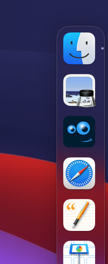
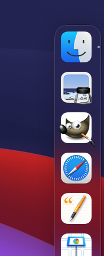

# GIMP application icons

## Photoshop 22

Icon mimics the icon of Photoshop 22.

|  Ps22  |  &nbsp;  |  &nbsp;  |
|  :---:  |  :---:  |  :---:  |
|    |    |    |
|  256 × 256  |  16 × 16  |  Dock preview  |

## Wilber protrudes

Icon in which Wilber protrudes from a quare with rounded corners. Matches&nbsp;the macOS&nbsp;Big&nbsp;Sur icons&nbsp;style.

|  WilberProtrudes-macOSstyle  |  &nbsp;  |  &nbsp;  |
|  :---:  |  :---:   |  :---:   |
|    |    |    |
|  256 × 256  |  16 × 16  |  Dock preview  |

## Wilber clipped

Icon in which Wilber is clipped by a quare with rounded corners. Matches&nbsp;the macOS&nbsp;Big&nbsp;Sur icons&nbsp;style.

|  WilberClipped-macOSstyle  |  &nbsp;  |  &nbsp;  |
|  :---:  |  :---:  |  :---:  |
|    |    |    |
|  256 × 256  |  16 × 16  |  Dock preview  |
